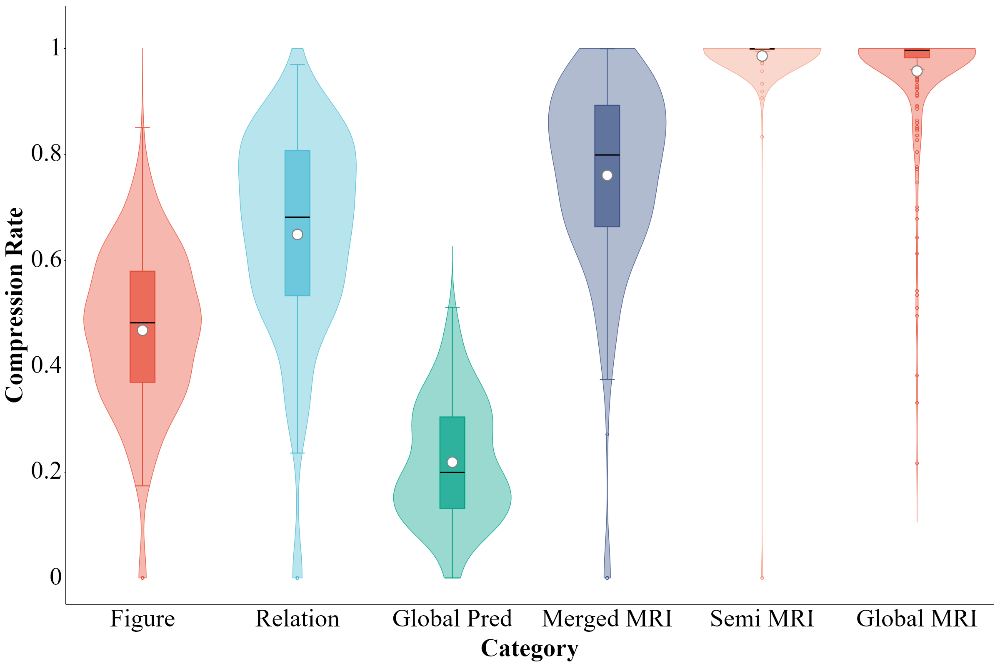

# ZGeoInference（KM-SCR）

<div align="center">

**基于演绎数据库的高效几何自动推理系统**

[English Documentation / English](README.md)

</div>

---

## 简介

基于规则的演绎数据库通过结合几何命题的已知条件与公理、定理等推理规则进行逻辑推导，在几何自动推理中具备严密的逻辑可靠性与卓越的知识发现能力。然而，在处理复杂几何问题时，推理搜索空间随问题规模呈指数级扩张，导致求解效率遭遇严重瓶颈。针对几何知识表示的冗余以及规则匹配机制过于刚性等问题，本文从知识与规则的双重表示层面切入：

- **几何对象合并表示** —— 对语义等价或可归约的几何对象及其拓扑关系统一建模，消除冗余表示，压缩推理空间。
- **连等式表示** —— 减少等式关系表示数量，加速推理中代数方程组的求解。
- **半条件规则表示** —— 将规则触发条件解耦为前置条件与约束条件，分步匹配，大幅减少匹配次数，克服组合爆炸。

基于该方法实现的 **KM-SCR** 几何定理推理系统，在 FormalGeo7k-L6 基准数据集上以平均 **7.78 秒**实现 **98.29%** 的求解准确率，显著优于已有方法。

## 核心机制

| 机制 | 说明 |
| --- | --- |
| 几何对象合并表示 | 统一建模语义等价/可归约对象，消除冗余，压缩推理空间。 |
| 连等式表示 | 减少等式关系数量，加速代数方程组求解。 |
| 半条件规则表示 | 解耦触发条件、分步匹配，减少匹配次数，避免组合爆炸。 |

下图展示了本方法中**规则实例化**与**知识实例化**的压缩归约效果。



## 实验结果

| 指标 | 数值 |
| --- | --- |
| 求解准确率 | **98.29%** |
| 平均推理耗时 | **7.78 秒** |

## 运行环境

- **.NET 10**（目标框架 `net10.0`）
- **Maple 2024**（系统通过 `maplec.dll` 调用 Maple 内核进行代数求解；请安装 Maple 2024 并配置运行环境）
- Windows 操作系统

## 调整并行线程数量

推理过程支持并行处理，可根据 CPU 情况调整同时运行的线程数量。默认最大并发数为 `16`。

在 `GeoInference.Tests/Program.cs` 中通过 `MaxThreads` 属性设置：

```csharp
IntegratedTester tester = new IntegratedTester();
// 根据 CPU 情况调整同时运行的线程数量
tester.MaxThreads = 10;
await tester.Test();
```

> **注意**：推理过程中线程数过多可能导致计算错误（返回时间字符串等异常），适当降低线程数量有助于缓解该问题。建议根据机器 CPU 核心数合理设置。

## 构建与运行

```bash
# 构建解决方案
dotnet build GeoInference.slnx

# 运行集成测试（在 FormalGeo7k-L6 上批量推理）
dotnet run --project GeoInference.Tests
```

运行时会自动定位 `Datasets/FormalGeo7KL6` 数据集，并将结果输出到 `Result/` 目录（推理 JSON、Excel 报告与图表）。

## 项目结构

```
ZGeoInference/
├── GeoInference/               # 核心推理引擎（.NET 10 可执行程序）
├── GeoInference.Tests/         # 批量测试与结果报告生成
├── Datasets/
│   └── FormalGeo7KL6/          # FormalGeo7k-L6 基准数据集
├── Result/                     # 推理结果、报告与图表
├── GeoInference.slnx           # 解决方案文件
└── README.md
```
